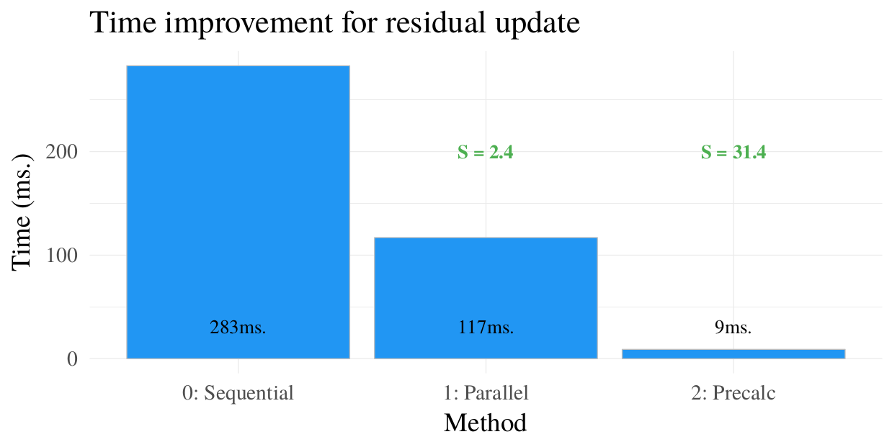
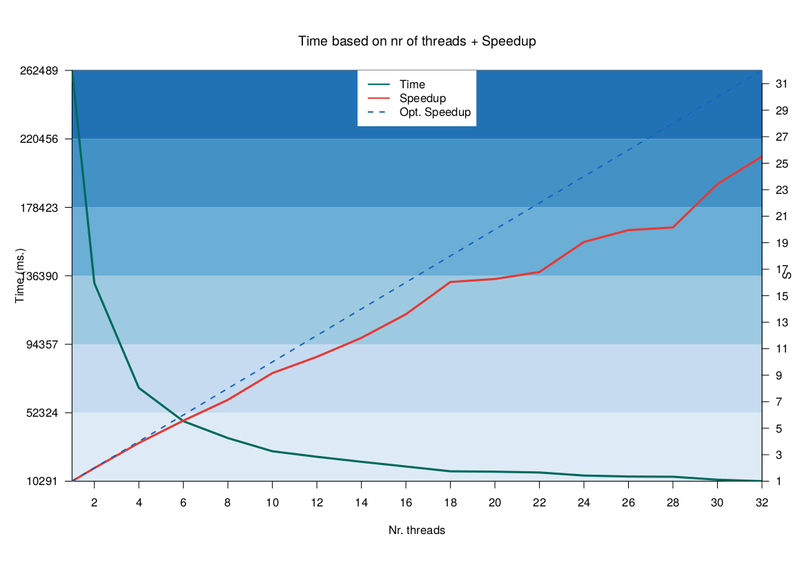

# HPC Project: Multi-thread implementation of BDT [1].

Project for master course _High Performance Computing_ (2018/2019) at Ca' Foscari University.

The project consists of implementing the method described in [1], and experimenting on ways to improve execution time.\
See [report](https://github.com/feliksh/HPC-BDT/blob/master/HPC_Feliks_Hibraj.pdf) for detailed explaination

**Improvement achieved:**
- **Speedup 25x**: modifying algorithm for better multi-threading execution
- **Speedup 31x**: cache-aware implementation of important functions

  
  

[1] Lou, Yin, and Mikhail Obukhov. "BDT: Gradient Boosted Decision Tables for High Accuracy and Scoring Efficiency." Proceedings of the 23rd ACM SIGKDD International Conference on Knowledge Discovery and Data Mining. ACM, 2017.
